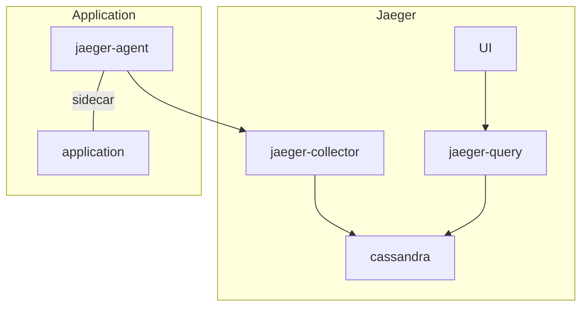

# gRPC Traces

We are collecting gRPC traces produced by the different Remote Execution APIs implementations. The main purpose is to gather insight regarding the internal behaviour of each implementation as well as identifying possible bottle-necks.  
Currently only __BuildBarn__ produces traces.

This project uses [Jaeger] to collect and access traces.

## Jaeger 

### Recommended Setup

A `jaeger-agent` is added to the pod of each applciations producing traces.  
Each `jaeger-agent` then send the traces to the `jaeger-collector` which will queue the them and apply the sampling policies before storing it in a __Cassandra__ databse.  
Finally the traces can be accessed via a web interface created by `jaeger-query`.

This recommended configuration works fine when used in an environment expected to be continuously up where traces will add up in the database and `jaeger-query` is externally available.  
However as for this project the __Kubernetes__  is only kept running during the execution of the CI pipeline  the traces produced will be lost after each run of the pipeline. to resolve this issue we use a slightly different approach consisting of the two following steps.

### Gathering Traces

This step is executed during the CI pipeline for each job producing traces. the objective of this step is to collect the traces produced by the applications of this step and persist them as `CSV` files in a `job artifact`.  
The following elements of the recommended setup are used in this step:

+ jaeger-collector

+ cassandra

+ jaeger-agent

+ application

the traces are collected and stored as recommended however once the job is done a shell script is executed to collect all the tables from the __Cassandra__ database as `CSV` files in the `traces` folder.

### Viewing Traces

Accessing the the traces is made by running the required elements locally and populating the database with the corresponding `CSV` files.  
In order to do it th following elements will be run locally:

+ jaeger-query

+ cassandra

To get all this running on your system follow those steps:

+ Download the folder holding the traces you are after

+ Execute the script providing the name of the folder containing the traces

+ Do `kubectl -n jaeger get services`

+ Open jaeger-query in your browser

[Jaeger]: https://www.jaegertracing.io
