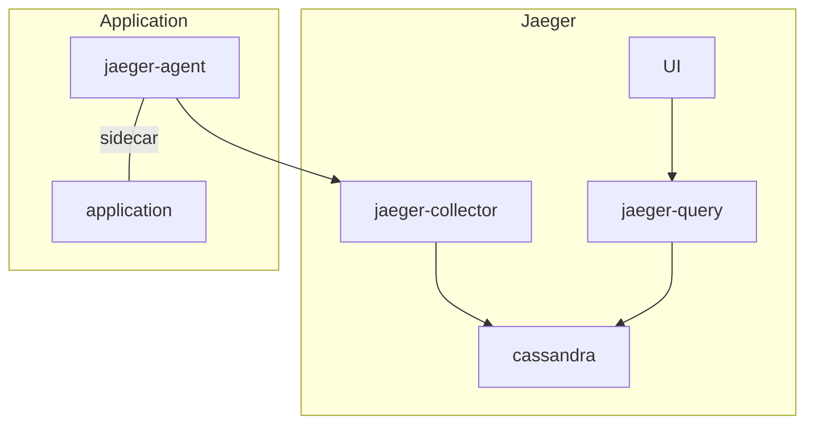

# gRPC Traces

We are collecting gRPC traces produced by the different Remote Execution APIs implementations. The main purpose is to gather insight regarding the internal behaviour of each implementation as well as identifying possible bottle-necks.  
Currently only __BuildBarn__ produces traces.

This project uses [Jaeger] to collect and access traces.


## Jaeger 

### Recommended Setup




A `jaeger-agent` is added to the pod of each applications producing traces.  
Each `jaeger-agent` then send the traces to the `jaeger-collector` which will queue the them and apply the sampling policies before storing it in a __Cassandra__ database.  
Finally the traces can be accessed via a web interface created by `jaeger-query`.

This recommended configuration works fine when used in an environment expected to be continuously up where traces will add up in the database and `jaeger-query` is externally available.  
However as for this project the __Kubernetes__  is only kept running during the execution of the CI pipeline  the traces produced will be lost after each run of the pipeline. to resolve this issue we use a slightly different approach consisting of the two following steps.

### Gathering Traces

This step is executed during the CI pipeline for each job producing traces. The objective of this step is to collect the traces produced by the applications of this step and persist them as `CSV` files in a `job artifact`.  
The following elements of the recommended setup are used in this step:

+ jaeger-collector

+ cassandra

+ jaeger-agent

+ application

The traces are collected and stored as recommended however once the job is done a shell script is executed to collect all the tables from the __Cassandra__ database as `CSV` files in the `traces` folder.

### Viewing Traces

You can view the traces for a given job with the `load-traces` script located in the `dev` folder. Before using this script make sure to have access to a __Kubernetes__ cluster and a folder containing all the `CSV` files produced by the job.  

> You can learn how to setup a __Kubernetes__ cluster in the [environment setup](environment-setup.md) document
> You can find the traces for a given job in the job's artifact in the `traces` folder

Once you have gather all the required elements; considering you are at the root of the project and the `CSV` files are in a folder named `traces`, you can run the script using the following command:

```
dev/load-traces.sh traces kubernetes/monitoring/
```

Now that you have all the required components running and ready you can find the path to jaeger-query with:

```
kubectl -n jaeger get services
```

If the ip for jaeger-query service is pending use this command to port-forward jaeger-query to port 16686, this will allow you to access the webpage at `localhost:16686`:

```
kubectl -n jaeger port-forward service/jaeger-query 16686:16686
```


[Jaeger]: https://www.jaegertracing.io
